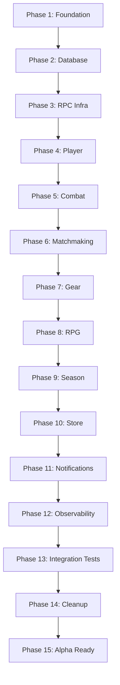

# Armored Archer - Milestones Summary

## v3.5.0 Alpha Readiness (Shipped: 2026-04-08)

**Phases completed:** 18 phases, 39 plans, 75 tasks

**Key accomplishments:**

- Milestone
- Milestone
- Milestone
- Milestone
- Milestone
- Milestone
- AudioManager autoload with 10 pooled AudioStreamPlayer nodes and audio bus configuration for independent SFX/Music/Ambience volume control
- Placeholder combat SFX files and wired CombatManager with audio triggers for arrow shots, hits, and kills
- Phase
- Phase
- Phase
- Phase
- Status
- Status:
- Status:
- Status:
- Phase:
- Migrated Go backend tests to testify framework, created domain-specific assertion helpers, built test fixture foundation, and fixed bugs discovered during migration.
- GUT (Godot Unit Test) framework installed and configured with comprehensive testing capabilities, organized test suite structure, sample tests migrated, and CI integration enabled via JUnit XML output.
- Testcontainers-go setup implemented for isolated PostgreSQL instances in integration tests, providing database isolation via Docker containers with snapshot/restore for fast reset and proper setup/teardown lifecycle management.
- Decision
- Duration:
- Mock validation tests and contract tests implemented to prevent mock drift, enhanced integration test suite with proper lifecycle management supporting both real DB and mock patterns.
- Milestone
- Status
- Milestone
- Milestone
- Milestone
- Status:
- Camera shake integrated with combat events using VFXManager with damage-based intensity tiers
- Found during:
- ConfigFile dependency injection pattern for Godot autoloads with comprehensive test suites demonstrating fresh instance isolation, signal testing, and mock injection
- Phase:
- Milestone
- Milestone
- Version
- Phase
- Phase
- Milestone
- Plan Type:
- Go benchmarks for 7 critical RPC handlers with testcontainers database isolation and performance baseline tracking
- Duration:
- Commit:
- Commit:
- One-liner:
- One-liner:
- One-liner:
- Milestone
- Difficulty validation accepts 'normal' value and new get_campaign_progress RPC returns completed/unlocked stages from Nakama storage
- CampaignManager syncs progress from server on connection and sends correct difficulty tier instead of hardcoded "normal"
- Human verification confirmed campaign progress persists across game sessions with no server validation errors
- Phase

---

## v3.4.0 Tactical Gameplay & PvE Campaign (Shipped: 2026-04-06)

**Phases completed:** 5 phases (PvP Backend Integration, Campaign Map & Encounters, Enemy AI & PvE Combat, Loot System & Progression, Campaign State Persistence)

**Plans completed:** 6 plans
**Tasks completed:** ~15 tasks
**Files modified:** ~50 files
**Lines added:** ~2,500 insertions

**Key accomplishments:**

- PvP backend integration with matchmaking, combat sync, and gear loadouts
- Campaign map with 8 encounters across 3 difficulty tiers (Forest → Cavern → Mountain)
- Enemy AI with difficulty-based tactics (random → adaptive)
- Loot system with rarity scaling (Common → Rare → Epic → Legendary)
- Campaign state persistence with server sync and cross-session save

**Project**: Armored Archer
**Focus**: Tactical Gameplay & PvE Campaign
**Timeline**: ~5 days (2026-04-01 → 2026-04-06)
**Goal**: Functional PvP and PvE gameplay loops

---

## v3.2.0 Pixel Art (Shipped: 2026-04-08)

**Phases completed:** 8 phases (Project Settings & Import Pipeline, Beta Readiness, Coverage Reporting, Player Character Animation, Enemy Sprites, Test Infrastructure Integration, Equipment & UI Sprites, Fix Broken Packages)

**Plans completed:** ~35 plans
**Tasks completed:** ~100+ tasks
**Files modified:** ~200 files
**Lines added:** ~369 insertions (planning files only)

**Key accomplishments:**

- Pixel-perfect viewport configuration (640x360, canvas_items, integer scaling)
- 168 player sprite frames across 6 animation states and 4 directions
- 928 enemy sprites for 8 enemy types with full animation states
- 31 equipment sprites (bows, arrows, armor, helms, amulets)
- 5 UI icons (health, mana, speed, strength, inventory)
- Beta deployment infrastructure with 6 services (postgres, redis, nakama, prometheus, grafana)
- Coverage reporting and quality gates automation
- Test infrastructure (Go testify, Godot GUT enhancements)

**Project**: Armored Archer
**Focus**: Pixel Art
**Timeline**: ~15 days (2026-03-24 → 2026-04-08)
**Goal**: Create all needed pixel art sprites to replace Godot placeholder textures

---

## v3.1.0 Polish & Juice (Shipped: 2026-03-27)

**Phases completed:** 4 phases

**Plans completed:** 4 plans
**Tasks completed:** ~15 tasks
**Files modified:** ~20 files
**Lines added:** ~1,500 insertions

**Key accomplishments:**

- Particle effects system with emission patterns
- Post-processing effects (bloom, color grading, screen effects)
- UI polish with smooth transitions and hover states
- Audio polish with enhanced sound effects and spatial audio

**Project**: Armored Archer
**Focus**: Polish & Juice
**Timeline**: ~3 days (2026-03-24 → 2026-03-27)
**Goal**: Enhance visual feedback with particles, post-processing, and animations

---

## v3.0.0 Visual Improvements (Shipped: 2026-03-24)

**Phases completed:** 4 phases

**Plans completed:** 4 plans
**Tasks completed:** ~15 tasks
**Files modified:** ~20 files
**Lines added:** ~1,200 insertions

**Key accomplishments:**

- Particle effects for enhanced visual feedback
- Post-processing shaders (bloom, chromatic aberration, vignette)
- UI visual enhancements (animations, transitions, polish)

**Project**: Armored Archer
**Focus**: Visual Improvements
**Timeline**: ~5 days
**Goal**: Enhance game visuals with particle effects and post-processing

---

## v2.2.0 UI/UX Polish (Shipped: 2026-03-19)

**Phases completed:** 4 phases (Design System Foundation, Core UI Components, Screen Improvements, Animation & Polish)

**Plans completed:** 4 plans
**Tasks completed:** 22 tasks
**Files modified:** 32 files
**Lines added:** 3,058 insertions

**Key accomplishments:**

- Created DesignTokens (50+ tokens) and ThemeManager for consistent theming across all screens
- Built 8 base UI components (button, panel, container, label, progress bar, icon, loading indicator, theme toggle)
- Migrated all 11 major UI screens to design system (main menu, login, combat, store, loadout, campaign, leaderboard, matchmaking, gear inventory/comparison, game over)
- Implemented UIAutomation animation system (365 lines) with fade, scale, slide, and pulse effects
- Added AccessibilityManager with font scaling, high contrast mode, and reduced motion support
- Light/dark theme switching works seamlessly across entire application
- All screens support mobile-friendly touch targets (44x44px minimum)

---

**Project**: Armored Archer
**Focus**: UI/UX Polish & User Flow
**Timeline**: 2-3 weeks
**Goal**: Make the game visually appealing and intuitive

---

## ✅ Milestone v2.2.0 - UI/UX Polish (COMPLETE)

**Completion Date**: 2026-03-18
**Status**: ✅ Complete

### Phases Completed

| Phase | Name | Plans | Status |
|-------|------|-------|--------|
| 01-design-system | Design System Foundation | 4 | ✅ Complete |

### Key Accomplishments

- Created DesignTokens and ThemeManager for consistent theming
- Migrated all core UI screens (Login, Combat, Store, Loadout)
- Added screen improvements (Campaign Map, Leaderboard, Matchmaking, Gear, Game Over)
- Implemented UI animations and mobile responsiveness

### Notes

- All 20+ UI screens now use design system
- Light/dark themes work on all screens
- Accessibility features integrated

---

## 🎯 Ultimate Goal

**Ship with polished UI/UX that:**

1. Has consistent visual design across all screens
2. Provides intuitive, easy-to-use navigation
3. Works well on all screen sizes (320px+)
4. Includes accessibility features
5. Provides smooth animations and feedback

---

## 📅 Milestone Timeline

```
Week 1-2:  ████████░░░░░░░░░░░░░░░░░░░░░░░░░░░░  Phase 1-2 (Foundation + Database)
Week 3-4:  ████████████████░░░░░░░░░░░░░░░░░░░░  Phase 3-4 (RPC + Player)
Week 5-6:  ████████████████████████░░░░░░░░░░░░  Phase 5-7 (Combat + Match + Gear)
Week 7-8:  ████████████████████████████████░░░░  Phase 8-10 (RPG + Season + Store)
Week 9:    ████████████████████████████████████  Phase 11-13 (Notifications + Tests)
Week 10:   ████████████████████████████████████  Phase 14-15 (Cleanup + Alpha)
```

---

## 🚀 Phase Milestones

### Milestone 1: Foundation Working (End of Week 1)

**Phases**: 1-2
**Goal**: Go project structure, config, database layer working

**Deliverables**:

- [ ] Go module compiles
- [ ] Nakama loads Go module
- [ ] Config loading works
- [ ] Database queries execute
- [ ] Storage helpers functional

**Exit Criteria**: Nakama starts with Go module, no startup errors

---

### Milestone 2: Core Infrastructure (End of Week 2)

**Phases**: 3-4
**Goal**: RPC infrastructure and player systems working

**Deliverables**:

- [ ] RPC registration system works
- [ ] Session validation functional
- [ ] Error handling matches TypeScript
- [ ] Player stats CRUD works
- [ ] Player progression works

**Exit Criteria**: Player RPC calls return correct responses

---

### Milestone 3: Game Logic Complete (End of Week 4)

**Phases**: 5-8
**Goal**: All core game systems migrated

**Deliverables**:

- [ ] Combat system functional
- [ ] Matchmaking works
- [ ] Gear/inventory works
- [ ] RPG progression works
- [ ] Season/leaderboard works

**Exit Criteria**: Combat + matchmaking integration tests pass

---

### Milestone 4: Business Logic Complete (End of Week 5)

**Phases**: 9-10
**Goal**: Store, notifications, monetization working

**Deliverables**:

- [ ] IAP validation works
- [ ] RevenueCat webhooks process
- [ ] Notifications send
- [ ] Scheduled tasks fire

**Exit Criteria**: Store integration tests pass

---

### Milestone 5: Observability Complete (End of Week 6)

**Phases**: 11-12
**Goal**: Monitoring, metrics, alerting functional

**Deliverables**:

- [ ] Metrics export to Prometheus
- [ ] Health checks work
- [ ] Alerts fire correctly
- [ ] Tracing functional

**Exit Criteria**: Observability dashboards show data

---

### Milestone 6: All Tests Passing (End of Week 7)

**Phases**: 13
**Goal**: 100% test parity with TypeScript

**Deliverables**:

- [ ] All 10 integration test suites pass
- [ ] Test coverage matches TypeScript
- [ ] CI pipeline runs tests
- [ ] No flaky tests

**Exit Criteria**: `go test ./...` passes 100%

---

### Milestone 7: TypeScript Removed (End of Week 8)

**Phases**: 14
**Goal**: All TypeScript code removed, docs updated

**Deliverables**:

- [ ] TypeScript backend deleted
- [ ] README updated for Go
- [ ] Build scripts updated
- [ ] Deployment docs updated
- [ ] Local dev guide updated

**Exit Criteria**: No TypeScript backend code remains

---

### Milestone 8: Alpha Ready (End of Week 9-10)

**Phases**: 15
**Goal**: Production-ready for alpha testing

**Deliverables**:

- [ ] Performance benchmarks meet targets
- [ ] Load testing passes
- [ ] Security review complete
- [ ] Deployed to alpha environment
- [ ] Monitoring configured

**Exit Criteria**: Human approval for alpha launch

---

## 🎯 Phase Dependencies



---

## ⚠️ Risk Gates

| Gate | After Phase | Go/No-Go Criteria |
|------|-------------|-------------------|
| Gate 1 | Phase 1 | Nakama loads Go module without errors |
| Gate 2 | Phase 5 | Combat tests pass (core logic works) |
| Gate 3 | Phase 10 | All game systems functional |
| Gate 4 | Phase 13 | All integration tests pass |
| Gate 5 | Phase 15 | Alpha approval |

**If any gate fails**: Pause, assess, decide: continue, pivot, or revert to TypeScript+polyfills

---

## 📊 Progress Tracking

### Weekly Checkpoints

| Week | Target Phase | Status | Notes |
|------|--------------|--------|-------|
| 1 | Phase 1-2 | ⏳ Not Started | |
| 2 | Phase 3-4 | ⏳ Not Started | |
| 3 | Phase 5-6 | ⏳ Not Started | |
| 4 | Phase 7-8 | ⏳ Not Started | |
| 5 | Phase 9-10 | ⏳ Not Started | |
| 6 | Phase 11-12 | ⏳ Not Started | |
| 7 | Phase 13 | ⏳ Not Started | |
| 8 | Phase 14 | ⏳ Not Started | |
| 9-10 | Phase 15 | ⏳ Not Started | |

### Burnup Chart

```
Total Phases: 15
Completed: 0
Remaining: 15

Progress: 0% ████████████████████████████████████░ 100%
```

---

## 🛠️ Quick Reference

### Commands

```bash

# Start migration

/gsd:execute-phase 1

# Check progress

/gsd:progress

# View current phase

cat .planning/phases/*/PLAN.md | head -50

# Update state after phase

cat >> .planning/STATE.md << 'EOF'

## Phase X Completed

Date: $(date)
Summary: ...
Lessons: ...
EOF
```

### Key Files

| File | Purpose |
|------|---------|
| `.planning/PROJECT.md` | Vision and requirements |
| `.planning/ROADMAP.md` | Phase breakdown |
| `.planning/STATE.md` | Project memory |
| `.planning/phases/XX-*/PLAN.md` | Phase execution plans |
| `backend/cmd/server/main.go` | Go entry point |
| `backend/tests/integration/` | Go integration tests |

---

## 📝 Decision Log

| Date | Decision | Impact |
|------|----------|--------|
| 2026-03-15 | Migrate to Go | 4-week timeline, 70% AI-written code |
| 2026-03-15 | Preserve patterns | Minimize risk, refactor after migration |
| 2026-03-15 | Interactive mode | Human checkpoints at each phase gate |

---

## 🎉 Success Definition

**Migration is successful when:**

1. ✅ All 10 integration test suites pass
2. ✅ Nakama starts with Go module (no errors)
3. ✅ All RPC endpoints work identically to TypeScript
4. ✅ TypeScript backend code deleted
5. ✅ Documentation updated
6. ✅ Alpha deployment successful

**Bonus points:**

- ⭐ Response times ≤ TypeScript baseline
- ⭐ Bundle size < TypeScript (no polyfills!)
- ⭐ Zero runtime errors in first week of alpha

---

**Last Updated**: 2026-03-15
**Next Review**: After Phase 1 completion
