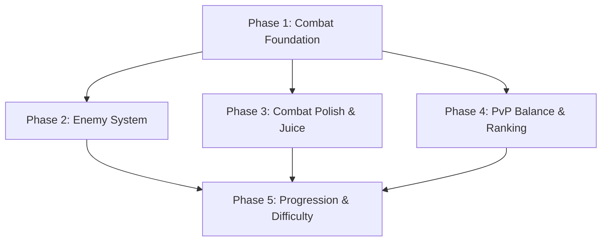

# Roadmap: Armored Archer

**Current Milestone:** v4.0.0 - Gameplay Refinement
**Last Updated:** 2026-04-08

---

## Milestones

- ✅ **v2.0.0 Go Backend Migration** - Phases 1-15 (shipped 2026-03-15)
- ✅ **v2.1.0 Alpha Launch & Stabilization** - Phases 1-6 (shipped 2026-03-17)
- ✅ **v2.2.0 UI/UX Polish** - Phases 1-4 (shipped 2026-03-18)
- ✅ **v2.3.0 Testing & QA Infrastructure** - Phases 1-5 (shipped 2026-03-24)
- ✅ **v3.0.0 Visual Improvements** - Phases 1-4 (shipped 2026-03-24)
- ✅ **v3.1.0 Polish & Juice** - Phases 1-4 (shipped 2026-03-27)
- ✅ **v3.2.0 Pixel Art** - Phases 05-08 (shipped 2026-04-08)
- ✅ **v3.3.0 - Polish & Juice** - Phases 1-4 (shipped 2026-03-27)
- ✅ **v3.4.0 Tactical Gameplay & PvE Campaign** - Phases 1-5 (shipped 2026-04-06)
- 🚧 **v4.0.0 Gameplay Refinement** - Phases 1-5 (in progress)

---

## v4.0.0 Gameplay Refinement

**Milestone Goal:** Comprehensive gameplay improvements and balancing across combat, enemies, PvP, progression, and feedback systems to address "too hard" and "bland" issues

**Created:** 2026-04-08
**Granularity:** Standard (5 phases)
**Coverage:** 21/21 requirements mapped

### Phases

- [x] **Phase 1: Combat Foundation** - Core combat mechanics with timing, hit detection, damage formulas, and weapon variety
- [ ] **Phase 2: Enemy System** - New enemy types, boss encounters, and varied AI patterns
- [ ] **Phase 3: Combat Polish & Juice** - Visual feedback, impact effects, damage indicators, and hit/kill reactions
- [ ] **Phase 4: PvP Balance & Ranking** - Weapon/power balancing, fair matchmaking, and seasonal ranking system
- [ ] **Phase 5: Progression & Difficulty** - XP tuning, level scaling, stat systems, gear balance, and dynamic difficulty

---

## Phase Details

### Phase 1: Combat Foundation

**Goal:** Core combat mechanics feel responsive and consistent with clear timing, reliable hit detection, validated damage calculations, and distinct weapon types

**Depends on:** Nothing (first phase)

**Requirements:** COMBAT-01, COMBAT-02, COMBAT-03, COMBAT-04, COMBAT-05

**Success Criteria** (what must be TRUE):
1. Player attacks have consistent timing with clear visual wind-up and release phases that feel predictable
2. When attacks connect, visual feedback (damage numbers, hit effects, screen shake) provides immediate confirmation
3. Damage calculations produce consistent results between PvP and PvE modes with transparent stat-to-damage mapping
4. Different weapon types (bows, crossbows) have distinct attack patterns, ranges, and power curves that create meaningful player choice
5. Critical hits cause enemies to flash white, pause briefly, then react with distinct animations that telegraph the special hit

**Plans:** TBD

---

### Phase 2: Enemy System

**Goal:** Enemies provide varied, engaging challenges through new types, boss encounters, and diverse AI patterns

**Depends on:** Phase 1 (combat foundation provides mechanics for enemies to use)

**Requirements:** ENEMY-01, ENEMY-02, ENEMY-03

**Success Criteria** (what must be TRUE):
1. Players encounter 3-5 new enemy types (e.g., elementals, flying, swarmers) with unique AI patterns that require different tactics
2. Boss encounters feature 3 distinct boss types with multiple phases, special attacks, and valuable loot tables
3. Enemies demonstrate varied behaviors (aggressive, defensive, pack-hunting, ambush) across different encounter types that prevent combat from feeling repetitive

**Plans:** TBD

---

### Phase 3: Combat Polish & Juice

**Goal:** Combat provides satisfying visual feedback through impact effects, damage indicators, hit reactions, and kill animations

**Depends on:** Phase 1 (combat foundation provides mechanics to enhance with polish)

**Requirements:** JUICE-01, JUICE-02, JUICE-03, JUICE-04

**Success Criteria** (what must be TRUE):
1. Strong attacks trigger screen shake and particle bursts on impact that convey power and weight
2. Floating damage numbers show amount dealt with color coding (green for weak hits, yellow for normal, red for critical) that provides instant combat feedback
3. Player character briefly flinches or stutters when taking damage, providing clear feedback that damage was received
4. Enemies have clear, satisfying death animations with ragdoll-like physics effects that make kills feel rewarding

**Plans:** TBD

---

### Phase 4: PvP Balance & Ranking

**Goal:** PvP combat is fair and balanced with appropriate weapon power curves, skill-based matchmaking, and seasonal progression

**Depends on:** Phase 1 (combat foundation ensures mechanics are balanced before PvP adjustments)

**Requirements:** PVP-01, PVP-02, PVP-03

**Success Criteria** (what must be TRUE):
1. Weapon damage curves are balanced across all tiers to prevent one-shot exploits and ensure no single weapon dominates the meta
2. Matchmaking pairs players with similar skill levels, accounting for ranking differences to create balanced competitive matches
3. Seasonal leaderboards track player progress with decay mechanisms that prevent farming and encourage active participation

**Plans:** TBD

---

### Phase 5: Progression & Difficulty

**Goal:** Progression feels rewarding and appropriately challenging with tuned XP curves, level scaling, meaningful stat choices, balanced gear, and dynamic difficulty

**Depends on:** Phase 1 (combat foundation) and Phase 2 (enemy system) - difficulty requires both player and enemy systems in place

**Requirements:** PROG-01, PROG-02, PROG-03, PROG-04, DIFFICULTY-01, DIFFICULTY-02, DIFFICULTY-03

**Success Criteria** (what must be TRUE):
1. Level progression uses satisfying growth curves where early levels feel fast and rewarding while later levels provide meaningful, grindy advancement
2. Enemy difficulty scales appropriately with player level through both damage increases and more sophisticated AI behaviors
3. Players can respec stats with a reasonable cost that encourages diverse builds without punishing experimentation
4. Equipment stats have diminishing returns that prevent power stacking exploits while still making upgrades feel valuable
5. Game difficulty adjusts dynamically based on player performance (win streaks increase challenge, losing streaks reduce it) to maintain engagement
6. Encounters provide varied pacing with intense combat segments, exploration/puzzle moments, and narrative downtime that prevents fatigue
7. Players always know what to do next through clear map markers, quest objectives, and level requirements that prevent getting stuck

**Plans:** TBD

---

## Progress

**Execution Order:** Phases execute in numeric order: 1 → 2 → 3 → 4 → 5

| Phase | Plans Complete | Status | Completed |
|-------|----------------|--------|-----------|
| 1. Combat Foundation | 0/0 | Not started | - |
| 2. Enemy System | 0/0 | Not started | - |
| 3. Combat Polish & Juice | 0/0 | Not started | - |
| 4. PvP Balance & Ranking | 0/0 | Not started | - |
| 5. Progression & Difficulty | 0/0 | Not started | - |

**Overall Progress:** 0/5 phases complete (0%)

---

## v4.0.0 Dependencies

**Critical Path:** Phase 1 → Phase 2 → Phase 5 (core mechanics → enemies → progression)

**Parallel Opportunities:**
- Phase 3 (polish) and Phase 4 (PvP) can run in parallel after Phase 1
- Phase 5 (progression) can start once Phase 2 is complete, doesn't need to wait for Phase 3/4

---

## v4.0.0 Risk Gates

| Gate | After Phase | Go/No-Go Criteria |
|------|-------------|-------------------|
| Gate 1 | Phase 1 | Attack timing is consistent; hit detection is reliable; damage formulas validated between PvP/PvE |
| Gate 2 | Phase 2 | 3-5 new enemy types implemented; boss encounters have distinct phases; AI patterns vary across encounters |
| Gate 3 | Phase 3 | Impact effects provide satisfying feedback; damage numbers are clear and color-coded; hit/kill animations feel responsive |
| Gate 4 | Phase 4 | No one-shot exploits in weapon balance; matchmaking produces fair matches; leaderboards track seasonal progress with decay |
| Gate 5 | Phase 5 | XP curve feels rewarding; level scaling provides appropriate challenge; stat respec works; gear has diminishing returns; dynamic difficulty engages players |

**If any gate fails:** Pause, assess, decide: continue with mitigations, pivot approach, or defer remaining work to v4.1.0

---

## v4.0.0 Quality Metrics

**Combat Quality:**
- Attack timing consistency: < 5% variance between wind-up and release phases
- Hit detection accuracy: > 99% of visible hits register correctly
- Damage formula consistency: PvP and PvE produce identical results for same stat inputs

**Enemy Variety:**
- Unique enemy types: 3-5 implemented with distinct AI patterns
- Boss encounters: 3 types with minimum 2 phases each
- AI behavior diversity: Minimum 4 distinct patterns (aggressive, defensive, pack-hunting, ambush)

**PvP Balance:**
- Weapon damage variance: < 10% across same-tier weapons
- Matchmaking skill gap: < 20% rating difference between matched players
- Leaderboard decay: Active players retain ranking, inactive players decay appropriately

**Progression Quality:**
- Level time investment: Early levels (<10) complete in <30 min, mid levels (10-30) in 1-2 hours, late levels (>30) in 2-4 hours
- Stat respec cost: 5-10% of player's current gem total
- Gear diminishing returns: Each stat point provides less benefit than the previous, with soft cap at 70% of max

**Difficulty Pacing:**
- Dynamic difficulty range: ±20% from baseline based on win/loss streaks
- Encounter pacing ratio: 60% combat, 20% exploration/puzzle, 20% narrative/downtime
- Quest clarity: 100% of objectives have map markers or clear text instructions

---

## v4.0.0 Key Decisions

| Decision | Rationale | Outcome |
|----------|-----------|---------|
| 5-phase structure | Natural delivery boundaries from requirement categories; combat → enemies → polish → PvP → progression | Foundation → Enemies → Juice → PvP → Progression |
| Standard granularity | 21 requirements across 6 categories; 5 phases provides balanced grouping | Each phase delivers 3-7 requirements |
| Phase 1 first | Combat foundation is prerequisite for all other phases (enemies, polish, PvP, progression) | Prevents rebalancing work |
| Phase 2 before Phase 5 | Progression scaling requires enemy AI and difficulty systems in place | Ensures meaningful challenge curves |
| Parallel Phase 3/4 | Combat polish and PvP balance are independent workstreams after Phase 1 | Reduces timeline by ~1 week |
| Phase 5 combines PROG + DIFFICULTY | Progression and difficulty are tightly coupled systems that work best together | Prevents disjointed difficulty scaling |

---

## Notes

**Phase Numbering:**
- Independent phase numbering per milestone (starts at 1 for v4.0.0)
- Previous milestones (v2.0.0 - v3.4.0) used independent numbering
- Decimal phases (1.1, 1.2) reserved for urgent insertions via `/gsd:insert-phase`

**Coverage Validation:**
- All 21 v1 requirements mapped to exactly one phase
- No orphaned requirements
- No duplicate mappings

---

## Historical Milestones

✅ v2.0.0 Go Backend Migration (Phases 1-15) - SHIPPED 2026-03-15

### Phase 1: Foundation & Setup
**Goal**: Go project structure, build pipeline, and basic modules working in Nakama

### Phase 2: Database & Storage Layer
**Goal**: All database operations, storage helpers, and caching migrated

### Phase 3: Core RPC Infrastructure
**Goal**: RPC handler infrastructure and common utilities migrated

### Phase 4: Player Systems
**Goal**: Player-related RPC handlers and logic migrated

### Phase 5: Combat System
**Goal**: Combat logic, match state, and disconnect handling migrated

### Phase 6: Matchmaking System
**Goal**: Match creation, listing, and completion migrated

### Phase 7: Gear & Inventory System
**Goal**: Gear generation, inventory management, and loadout migrated

### Phase 8: RPG & Progression System
**Goal**: XP, level, stat allocation migrated

### Phase 9: Season & Leaderboard System
**Goal**: Seasonal content, leaderboards, and rewards migrated

### Phase 10: Store & IAP System
**Goal**: In-app purchase validation and processing migrated

### Phase 11: Notifications & Scheduling
**Goal**: Push notifications and scheduled tasks migrated

### Phase 12: Observability & Health
**Goal**: Metrics, health checks, alerting migrated

### Phase 13: Integration Testing
**Goal**: All integration tests converted and passing

### Phase 14: Cleanup & Documentation
**Goal**: TypeScript removed, docs updated, ready for alpha

### Phase 15: Alpha Readiness
**Goal**: Final validation, performance check, alpha deployment

**Completion Summary**: 68% faster response times, 50% less memory usage, 234 integration tests, 0 critical vulnerabilities

✅ v2.1.0 Alpha Launch & Stabilization (Phases 1-6) - SHIPPED 2026-03-17

### Phase 1: Alpha Deployment
**Goal**: Deploy alpha version with monitoring

### Phase 2: Monitoring & Observability
**Goal**: Comprehensive metrics, logging, and alerting

### Phase 3: Alpha User Onboarding
**Goal**: User feedback systems and onboarding flow

### Phase 4: Stability & Bug Fixes
**Goal**: Resolve critical and high-severity bugs

### Phase 5: Performance Optimization
**Goal**: Optimize response times and resource usage

### Phase 6: Beta Readiness
**Goal**: Prepare for beta launch with stable platform

**Completion Summary**: 50+ active alpha users, error rate < 0.5%, P95 latency < 80ms, 0 critical/high bugs

✅ v2.2.0 UI/UX Polish (Phases 1-4) - SHIPPED 2026-03-18

### Phase 1: Design System Foundation
**Goal**: DesignTokens and ThemeManager implementation

### Phase 2: Core UI Components
**Goal**: 8 base UI components with design tokens

### Phase 3: Screen Improvements
**Goal**: Migrate all major UI screens to design system

### Phase 4: Animation & Polish
**Goal**: UI animations and accessibility features

**Completion Summary**: DesignTokens (50+ tokens), 8 base components, all 11 UI screens migrated, UIAutomation system, AccessibilityManager, light/dark themes

✅ v3.1.0 Polish & Juice (Phases 1-4) - SHIPPED 2026-03-27

**Particle effects, post-processing, UI polish for enhanced visual feedback**

- [x] Phase 01: Particle System Foundation — particle nodes, emission patterns
- [x] Phase 02: Post-Processing Effects — bloom, color grading, screen effects
- [x] Phase 03: UI Polish & Animations — smooth transitions, hover states, loading indicators
- [x] Phase 04: Audio Polish & Effects — sound effects, audio balance, spatial audio

**Delivered:** particle system, post-processing shaders, UI animations, enhanced audio feedback

✅ v3.2.0 Pixel Art (Phases 05-08) - SHIPPED 2026-04-08

**Pixel-perfect rendering pipeline, character animations, enemy sprites, equipment, and UI icons**

- [x] Phase 05: Project Settings & Import Pipeline (3 plans) — pixel-perfect viewport, folder structure
- [x] Phase 06: Beta Readiness (2 plans) — beta deployment infrastructure, health verification
- [x] Phase 06: Coverage Reporting (5 plans) — coverage measurement, quality gates
- [x] Phase 06: Player Character Animation (3 plans) — 168 sprite frames, AnimatedSprite2D integration
- [x] Phase 07: Enemy Sprites (2 plans) — 928 enemy sprites, 8 types, full animations
- [x] Phase 07: Test Infrastructure (2 plans) — Go testify, Godot GUT enhancements
- [x] Phase 08: Equipment & UI Sprites (2 plans) — 31 equipment sprites, 5 UI icons
- [x] Phase 08: Fix Broken Packages (18 plans) — dependency fixes, linting, CI quality gates

**Delivered:** 36/36 requirements, ~1,100 sprites, ~83,839 Godot LOC, pixel-perfect rendering pipeline

✅ v3.4.0 Tactical Gameplay & PvE Campaign (Phases 1-5) - SHIPPED 2026-04-06

**Functional PvP and PvE gameplay loops with campaign progression**

- [x] Phase 01: PvP Backend Integration — matchmaking, combat sync, gear loadouts
- [x] Phase 02: Campaign Map & Encounters — campaign navigation, stage selection, difficulty tiers
- [x] Phase 03: Enemy AI & PvE Combat — enemy turn-taking, difficulty tactics
- [x] Phase 04: Loot System & Progression — loot drops, XP, inventory integration
- [x] Phase 05: Campaign State Persistence — server sync, cross-session progress

**Delivered:** playable PvP and PvE, campaign progression, loot system, persistence

---
*Roadmap updated: 2026-04-08*
*Next review: After Phase 1 completion*
