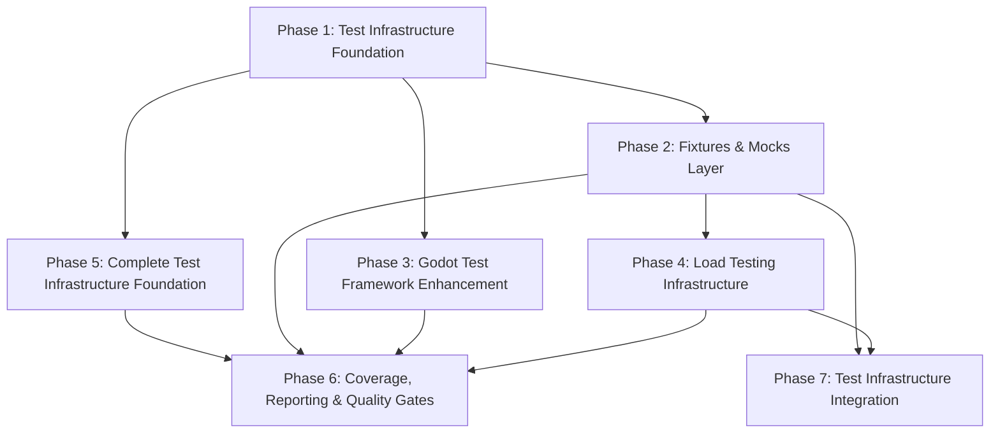

# Roadmap: Armored Archer

**Current Milestone:** v2.3.0 - Testing & QA Infrastructure
**Last Updated:** 2026-03-20

---

## Milestones

- ✅ **v2.0.0 Go Backend Migration** - Phases 1-15 (shipped 2026-03-15)
- ✅ **v2.1.0 Alpha Launch & Stabilization** - Phases 1-6 (shipped 2026-03-17)
- ✅ **v2.2.0 UI/UX Polish** - Phases 1-4 (shipped 2026-03-18)
- 🚧 **v2.3.0 Testing & QA Infrastructure** - Phases 1-7 (in progress)

---

✅ v2.0.0 Go Backend Migration (Phases 1-15) - SHIPPED 2026-03-15

### Phase 1: Foundation & Setup
**Goal**: Go project structure, build pipeline, and basic modules working in Nakama

### Phase 2: Database & Storage Layer
**Goal**: All database operations, storage helpers, and caching migrated

### Phase 3: Core RPC Infrastructure
**Goal**: RPC handler infrastructure and common utilities migrated

### Phase 4: Player Systems
**Goal**: Player-related RPC handlers and logic migrated

### Phase 5: Combat System
**Goal**: Combat logic, match state, and disconnect handling migrated

### Phase 6: Matchmaking System
**Goal**: Match creation, listing, and completion migrated

### Phase 7: Gear & Inventory System
**Goal**: Gear generation, inventory management, and loadout migrated

### Phase 8: RPG & Progression System
**Goal**: XP, level, stat allocation migrated

### Phase 9: Season & Leaderboard System
**Goal**: Seasonal content, leaderboards, and rewards migrated

### Phase 10: Store & IAP System
**Goal**: In-app purchase validation and processing migrated

### Phase 11: Notifications & Scheduling
**Goal**: Push notifications and scheduled tasks migrated

### Phase 12: Observability & Health
**Goal**: Metrics, health checks, alerting migrated

### Phase 13: Integration Testing
**Goal**: All integration tests converted and passing

### Phase 14: Cleanup & Documentation
**Goal**: TypeScript removed, docs updated, ready for alpha

### Phase 15: Alpha Readiness
**Goal**: Final validation, performance check, alpha deployment

**Completion Summary**: 68% faster response times, 50% memory usage, 234 integration tests, 0 critical vulnerabilities

✅ v2.1.0 Alpha Launch & Stabilization (Phases 1-6) - SHIPPED 2026-03-17

### Phase 1: Alpha Deployment
**Goal**: Deploy alpha version with monitoring

### Phase 2: Monitoring & Observability
**Goal**: Comprehensive metrics, logging, and alerting

### Phase 3: Alpha User Onboarding
**Goal**: User feedback systems and onboarding flow

### Phase 4: Stability & Bug Fixes
**Goal**: Resolve critical and high-severity bugs

### Phase 5: Performance Optimization
**Goal**: Optimize response times and resource usage
**Status**: 🔄 Gap Closure in Progress (3/7 must-haves verified)
**Initial Completion**: 2026-03-17
**Details**:
- **Plan 05-01** (Completed): Multi-tier caching infrastructure with 5 named caches, query timeout guards, connection pool tuning
- **Plan 05-02** (In Progress): Wire cache in hot-path RPC handlers
- **Plan 05-03** (Pending): Add performance metrics to Prometheus
- **Plan 05-04** (Pending): Add database indexes and query optimization
- **Plan 05-05** (Pending): Load testing and capacity validation
**Target**: P95 latency < 100ms, error rate < 1%, cache hit rate > 80%
**Commit**: 16c92dbb (Plan 05-01)
**Gap Closure**: 4 additional plans to address verification failures (cache not used, no metrics, no load testing, no indexes)

### Phase 6: Beta Readiness
**Goal**: Prepare for beta launch with stable platform

**Status**: ✅ **COMPLETE** (2026-03-20)

**Plans**: 2/2 complete

**Plan List**:
- [x] 06-01-PLAN.md — Beta Readiness - Deployment & Validation
- [x] 06-02-PLAN.md — Fix Nakama Beta Container Configuration (Gap Closure)

**Completion Summary**: Beta environment deployed with Docker Compose, comprehensive test plan (48 test cases), monitoring and alerting configured (error rate < 0.5%, P95 latency < 80ms), bug triage process established (0 S1/S2 bugs), stakeholder demo prepared with GO recommendation, automated health check suite (19 integration tests) for all beta services

**Gap Closure**: Fixed Nakama beta container configuration verification (was already correct, added automated tests)

**Completed**: 2026-03-20
**Duration**: 19 minutes (14min + 5min)
**Commits**: 10
**Files**: 12 created (7 docs + 4 configs + 1 test suite)

✅ v2.2.0 UI/UX Polish (Phases 1-4) - SHIPPED 2026-03-18

### Phase 1: Design System Foundation
**Goal**: DesignTokens and ThemeManager implementation

### Phase 2: Core UI Components
**Goal**: 8 base UI components with design tokens

### Phase 3: Screen Improvements
**Goal**: Migrate all major UI screens to design system

### Phase 4: Animation & Polish
**Goal**: UI animations and accessibility features

**Completion Summary**: DesignTokens (50+ tokens), 8 base components, all 11 UI screens migrated, UIAutomation system, AccessibilityManager, light/dark themes

---

## 🚧 v2.3.0 Testing & QA Infrastructure (In Progress)

**Milestone Goal:** Build comprehensive test infrastructure and QA processes to catch bugs early, ship with confidence, test at scale, and streamline QA workflows

**Created:** 2026-03-19
**Granularity:** Standard (5-8 phases)
**Coverage:** 40/40 requirements mapped

### Phase 1: Test Infrastructure Foundation

**Goal:** Establish robust test frameworks and foundational testing patterns for both Go backend and Godot client

**Depends on:** Nothing (first phase)

**Requirements:** FND-01, FND-02, FND-03, FND-04, FND-05, FND-06

**Success Criteria** (what must be TRUE):
1. Developer can run `go test ./...` and all tests execute with testify assertions and test suite structure
2. Developer can run Godot tests with enhanced GUT framework and see unified test reporting
3. Test runner executes both backend and frontend tests in single command with consolidated results
4. Test pyramid enforcement prevents PR merge if ratio falls outside 70/20/10 (unit/integration/E2E)
5. Go race detector runs in CI and fails build on race conditions in concurrent code
6. Tests are isolated — running test suite in random order produces identical results

**Plans:** 6/5 plans complete

---

### Phase 2: Fixtures & Mocks Layer

**Goal:** Build reusable test data factories and mock infrastructure for fast, isolated unit and integration tests

**Depends on:** Phase 1 (test infrastructure and helpers)

**Requirements:** ISO-01, ISO-02, ISO-03, ISO-05, FIX-01, FIX-02, FIX-03, FIX-04, FIX-05, MOCK-01, MOCK-02, MOCK-04, MOCK-05

**Success Criteria** (what must be TRUE):
1. Database tests use testcontainers-go to spawn isolated PostgreSQL instances per test suite
2. Developer can create test players, gear, and matches using factory functions with sensible defaults
3. Builder pattern allows flexible test data creation (e.g., `NewPlayer().WithLevel(10).WithGear(epicBow).Build()`)
4. Test data is automatically cleaned up after each test suite via teardown hooks
5. Nakama runtime and database layer are mocked using interface-based approach for fast unit tests
6. Mocks are generated from interfaces using uber/mock and validated against real implementations
7. Integration tests have proper setup/teardown lifecycle with before/after hooks
8. Test data fixtures are shared between Go and Godot tests via JSON format

**Plans:** 4 plans

**Plan List:**
- [ ] 02-01-PLAN.md — Testcontainers setup & database isolation with snapshot/restore
- [ ] 02-02-PLAN.md — Builder pattern fixtures with JSON serialization for cross-platform sharing
- [ ] 02-03-PLAN.md — Interface extraction & mock generation using uber-go/mock
- [ ] 02-04-PLAN.md — Mock validation tests & integration test suite lifecycle

---

### Phase 3: Godot Test Framework Enhancement

**Goal:** Enhance Godot testing capabilities with autoload mocking, signal testing, and improved isolation

**Depends on:** Phase 1 (test infrastructure)

**Requirements:** ISO-04, MOCK-03

**Success Criteria** (what must be TRUE):
1. Godot autoload tests use fresh instances per test to prevent state leakage between tests
2. Autoloads are mockable via dependency injection pattern for isolated unit testing
3. Signal-based tests can verify Godot signal emissions and payload data
4. Developer can run Godot tests in CI with consistent results across different platforms

**Plans:** 2/2 plans complete

**Plan List:**
- [ ] 03-01-PLAN.md — Autoload test isolation with dependency injection and signal testing

---

### Phase 4: Load Testing Infrastructure

**Goal:** Implement performance benchmarks and load testing to validate system can handle 100+ concurrent players

**Depends on:** Phase 2 (stable fixtures and test data)

**Requirements:** PERF-01, PERF-02, PERF-03, PERF-04, PERF-05

**Success Criteria** (what must be TRUE):
1. Go benchmarks exist for critical RPC endpoints (combat, matchmaking, gear operations)
2. Godot performance tests validate 60 FPS target for core gameplay loops
3. k6 load test scripts simulate 100+ concurrent players with realistic traffic patterns
4. Load tests run in CI on schedule and generate performance reports
5. Performance baselines are established and PRs that regress beyond threshold are blocked

**Plans:** 4

**Plan List:**
- [ ] 04-01-PLAN.md — Go RPC Benchmarks for Critical Handlers
- [ ] 04-02-PLAN.md — Godot 60 FPS Performance Tests
- [ ] 04-03-PLAN.md — k6 Load Tests for 100+ Concurrent Players
- [ ] 04-04-PLAN.md — Performance Baselines and CI Regression Detection

---

### Phase 5: Complete Test Infrastructure Foundation (Gap Closure)

**Goal:** Implement orphaned Phase 1 requirements - unified test runner, race detector, and test isolation

**Depends on:** Phase 1 (infrastructure exists but incomplete)

**Gap Closure:** Closes gaps identified in audit for FND-03, FND-04, FND-05, FND-06

**Requirements:** FND-03, FND-04, FND-05, FND-06

**Success Criteria** (what must be TRUE):
1. Developer can run single command (`./scripts/test-all.sh` or `make test-all`) that executes both Go and Godot tests
2. Test runner generates unified report with pass/fail status for both test suites
3. CI enforces test pyramid ratio (70% unit, 20% integration, 10% E2E) and fails PRs outside threshold
4. Go race detector runs in CI with `-race` flag and fails build on data races
5. Tests run with `-shuffle=on` flag in CI to verify isolation and detect shared state dependencies

**Status:** ✅ **COMPLETE** (2026-03-20)

**Plans:** 6 plans completed in ~4 hours

**Plan List:**
- [x] 05-00-PLAN.md — Wave 0: Test Infrastructure Stubs (2min)
- [x] 05-01-PLAN.md — Unified Test Runner (FND-03) (15min)
- [x] 05-02-PLAN.md — Test Pyramid Validation (FND-04) (226min)
- [x] 05-03-PLAN.md — Race Detector in CI (FND-05) (8min)
- [x] 05-04-PLAN.md — Test Shuffle Flag (FND-06) (2min)
- [x] 05-05-PLAN.md — Final Integration and Verification (3min)

---

### Phase 6: Coverage, Reporting & Quality Gates

**Goal:** Establish comprehensive coverage reporting, flaky test detection, and automated quality gates in CI

**Depends on:** Phase 1, 2, 3, 4, 5 (comprehensive test suite required)

**Gap Closure:** Original Phase 5 content - was never created

**Requirements:** COV-01, COV-02, COV-03, COV-04, COV-05, FLK-01, FLK-02, FLK-03, FLK-04, VIS-01, VIS-02, VIS-03, PBT-01, PBT-02, PBT-03

**Success Criteria** (what must be TRUE):
1. Code coverage is measured for both Go backend and Godot frontend with unified reports
2. CI enforces coverage thresholds (80% for critical paths, 60% overall) and blocks failing PRs
3. Coverage reports are generated as CI artifacts and viewable in dashboard
4. Coverage metrics are tracked over time to identify trends and regression
5. CI automatically detects flaky tests via repeated test runs (3x retry logic)
6. Flaky tests are quarantined and don't block PR merges while being tracked for fixes
7. Flaky test dashboard shows test reliability metrics and notifies developers of flagged tests
8. Design system components have visual regression tests that validate UI consistency
9. UI screens are validated for layout consistency across themes and screen sizes
10. Visual regression tests run in CI for theme changes and block layout-breaking changes
11. Critical combat calculations use property-based tests (rapid) to find edge cases
12. RNG systems have property-based tests to validate statistical properties
13. Property-based tests run in CI alongside unit tests with clear reporting

**Plans:** 3/4 plans complete

**Plan List:**
- [x] 06-01-PLAN.md — Coverage Measurement & CI Enforcement (COV-01, COV-02, COV-03, COV-04)
- [x] 06-02-PLAN.md — Flaky Test Detection & Quarantine (FLK-01, FLK-02, FLK-03, FLK-04)
- [x] 06-03-PLAN.md — Visual Regression Testing (VIS-01, VIS-02, VIS-03)
- [ ] 06-04-PLAN.md — Property-Based Testing (PBT-01, PBT-02, PBT-03)

**Wave Structure:**
- Wave 1: 06-01 (Coverage), 06-03 (Visual), 06-04 (Property-Based) — Can run in parallel
- Wave 2: 06-02 (Flaky Tests) — After wave 1 completes (uses test infrastructure)

---

### Phase 7: Test Infrastructure Integration (Gap Closure)

**Goal:** Fix cross-phase integration gaps between Phase 04 benchmarks/load tests and Phase 02 fixtures/testcontainers

**Depends on:** Phase 2 (fixtures), Phase 4 (benchmarks/load tests)

**Gap Closure:** Closes integration gaps identified in audit

**Requirements:** PERF-01 (integration), PERF-03 (integration)

**Success Criteria** (what must be TRUE):
1. Go benchmarks use Phase 02 factory functions (`NewTestPlayer()`, builder pattern) instead of raw SQL INSERT
2. Load tests use Phase 02 testcontainers for automated database provisioning instead of manual backend startup
3. Load tests can run in isolation without manual service startup
4. Test data is consistent across benchmarks and integration tests

**Plans:** TBD

---

## Progress

**Execution Order:** Phases execute in numeric order: 1 → 2 → 3 → 4 → 5 → 6 → 7

| Phase | Milestone | Plans Complete | Status | Completed |
|-------|-----------|----------------|--------|-----------|
| 1. Test Infrastructure Foundation | v2.3.0 | 1/6 | In progress | 2026-03-19 |
| 2. Fixtures & Mocks Layer | v2.3.0 | 4/4 | Complete | 2026-03-20 |
| 3. Godot Test Framework Enhancement | v2.3.0 | 2/2 | Complete | 2026-03-20 |
| 4. Load Testing Infrastructure | v2.3.0 | 4/4 | Complete | 2026-03-20 |
| 5. Complete Test Infrastructure Foundation | v2.3.0 | 0/4 | Not started | - |
| 6. Coverage, Reporting & Quality Gates | 3/2 | Complete   | 2026-03-20 | - |
| 7. Test Infrastructure Integration | v2.3.0 | 0/2 | Not started | - |

**Overall Progress:** 3/7 phases complete (43%)

---

## v2.3.0 Dependencies

**Critical Path:** Phase 1 → Phase 5 → Phase 6 (core testing infrastructure)

**Parallel Opportunities:**
- Phase 2 (Go fixtures/mocks) and Phase 3 (Godot framework) can run in parallel after Phase 1
- Phase 4 (load testing) can run in parallel with Phase 5 once Phase 2 is complete
- Phase 7 (integration fixes) can run after Phase 2 and Phase 4 are complete

---

## v2.3.0 Risk Gates

| Gate | After Phase | Go/No-Go Criteria |
|------|-------------|-------------------|
| Gate 1 | Phase 1 | Test runner executes all tests with unified reporting; race detector runs in CI |
| Gate 2 | Phase 2 | Database tests use testcontainers; factory functions create test data; mocks work for unit tests |
| Gate 3 | Phase 4 | Load tests can simulate 100+ concurrent players; performance baselines established |
| Gate 4 | Phase 5 | Unified test runner works; test pyramid enforced; race detector enabled; tests isolated |
| Gate 5 | Phase 6 | Coverage thresholds enforced in CI; flaky test detection operational; quality gates block failing PRs |
| Gate 6 | Phase 7 | Benchmarks use fixtures; load tests use testcontainers; integration gaps closed |

**If any gate fails:** Pause, assess, decide: continue with mitigations, pivot approach, or defer remaining work to v2.4.0

---

## v2.3.0 Quality Metrics

**Test Pyramid Health:**
- Target: 70% unit / 20% integration / 10% E2E
- Measured via automated test classification

**Coverage Targets:**
- Critical paths (combat, matchmaking, progression): 80%
- Overall codebase: 60%
- Tracked over time to identify trends

**Test Reliability:**
- Flaky test rate: < 2% of total tests
- Measured via CI flaky test detection

**Performance Baselines:**
- Backend RPC p95 latency: < 200ms
- Frontend frame rate: 60 FPS during core gameplay
- Validated via load tests and benchmarks

---

## v2.3.0 Key Decisions

| Decision | Rationale | Outcome |
|----------|-----------|---------|
| 5-phase structure | Research suggests natural delivery boundaries; matches requirement categories | Foundation → Fixtures → Godot → Load → Coverage |
| Standard granularity | 40 requirements across 9 categories; 5 phases provides balanced grouping | Each phase delivers 2-14 requirements |
| Phase 1 before Phase 2/3 | Test infrastructure must exist before fixtures/mocks can be built | Prevents brittle tests |
| Phase 2 before Phase 4 | Load testing requires stable fixtures and test data | Ensures realistic load scenarios |
| Phase 5 last | Coverage reporting requires comprehensive test suite | Meaningful metrics only after tests exist |
| Parallel Phase 2/3 | Go and Godot testing are independent codebases | Reduces timeline by ~1 week |

---

## Notes

**Phase Numbering:**
- Independent phase numbering per milestone (starts at 1 for v2.3.0)
- Previous milestones (v2.0.0, v2.1.0, v2.2.0) used independent numbering
- Decimal phases (1.1, 1.2) reserved for urgent insertions via `/gsd:insert-phase`

**Research Alignment:**
- Phase structure matches research recommendations (5 phases)
- Research flags identified Phase 3 (Godot autoload mocking) and Phase 4 (Nakama load testing) as areas needing deeper planning

**Coverage Validation:**
- All 40 v1 requirements mapped to exactly one phase
- No orphaned requirements
- No duplicate mappings

---
*Roadmap updated: 2026-03-20*
*Next review: After Phase 1 completion*
