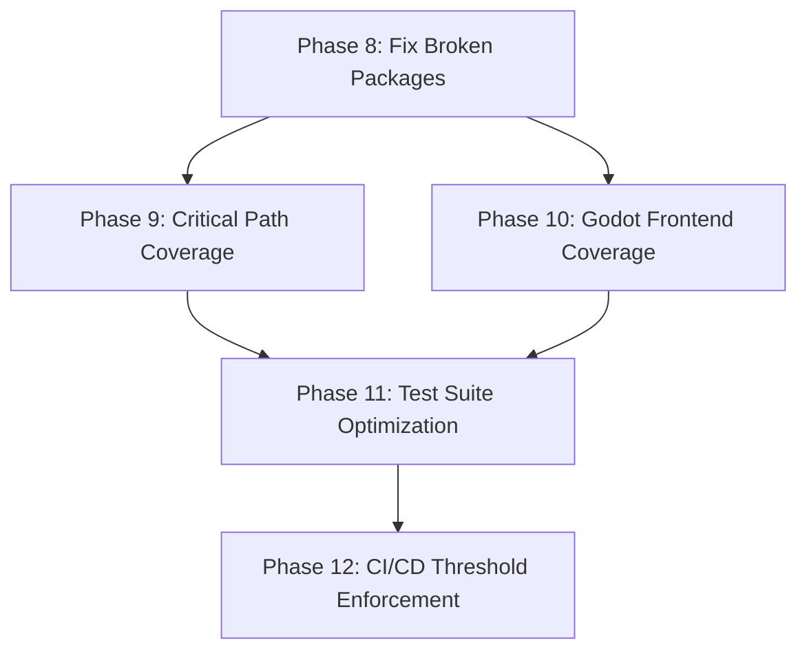

# Armored Archer - Roadmap

**Milestone:** v2.4.0 Test Coverage Improvement
**Goal:** Fix infrastructure gaps and raise test coverage across all modules to hit 60% threshold
**Granularity:** Standard
**Coverage:** 20/20 requirements mapped

---

## Phases

- [x] **Phase 8: Fix Broken Packages & Establish Quality Gates** - Enable accurate baseline measurement by fixing compilation errors and implementing quality gates
- [x] **Phase 9: Critical Path Coverage** - Achieve 80% coverage on high-risk, high-impact systems (combat, matchmaking, progression) before targeting overall 60% threshold — Complete: 2026-03-21
- [x] **Phase 10: Godot Frontend Coverage** - Ensure critical autoloads have comprehensive tests and maintain >95% pass rate — Complete: 2026-03-22
- [x] **Phase 11: Test Suite Optimization** - Enforce test pyramid, enable parallelization, and reduce flaky test rate — Complete: 2026-03-22
- [x] **Phase 12: CI/CD Threshold Enforcement** - Package-level tracking, incremental gates, and coverage dashboard — Complete: 2026-03-22

---

## Phase Details

### Phase 8: Fix Broken Packages & Establish Quality Gates

**Goal:** Enable accurate baseline coverage measurement by fixing compilation errors in broken packages and implementing quality gates to prevent coverage gaming

**Depends on:** Nothing (continues from v2.3.0 Phase 07)

**Requirements:** INF-01, INF-02, INF-03, INF-04, INF-05, INF-06, INF-07

**Success Criteria** (what must be TRUE):
1. All 27 Go backend packages compile successfully without errors
2. Baseline coverage measurement produces accurate report for all packages
3. CI/CD enforces at least one assertion per test to prevent coverage gaming
4. Mutation testing configuration detects tests without meaningful assertions
5. Gap analysis script automatically identifies all 0% coverage functions
6. Coverage threshold enforcement prevents regression (60% overall, 80% critical)
7. Package-level coverage tracking provides per-module visibility

**Plans:** 18
- [x] 08-01-PLAN.md — Fix notifications package compilation errors
- [x] 08-02-PLAN.md — Update coverage scripts for all 27 packages and package-level tracking
- [x] 08-03-PLAN.md — Create assertion quality gate tool
- [x] 08-04-PLAN.md — Create gap analysis script
- [x] 08-05-PLAN.md — Update CI workflow with quality gates
- [x] 08-06-PLAN.md — Fix test file syntax errors (rpg, season)
- [x] 08-07-PLAN.md — Fix trace.StatusCode API deprecation errors (metrics)
- [x] 08-08-PLAN.md — Remove || true from coverage script for complete measurement
- [x] 08-09-PLAN.md — Fix variable shadowing in season_test.go
- [x] 08-10-PLAN.md — Fix testhelpers.TestError undefined error (observability)
- [x] 08-11-PLAN.md — Fix undefined matchmaking functions (NewPlayerRanking, NewMatchRecord)
- [x] 08-12-PLAN.md — Fix mock interface implementation errors (RPC feedback cache)
- [x] 08-13-PLAN.md — Fix missing fmt import and syntax errors (store)
- [x] 08-14-PLAN.md — Fix XP calculation assertion errors (rpg)
- [x] 08-15-PLAN.md — Fix nil comparison error (season)
- [x] 08-16-PLAN.md — Fix circuit breaker test expectations (notifications)
- [x] 08-17-PLAN.md — Fix matchmaking test expectations (TestFilterMatches, TestGetRankFromElo)
- [x] 08-18-PLAN.md — Fix coverage generation for season, rpg, gear, notifications

**Gap Closure Notes:**
- Plans 08-06, 08-07, 08-08, 08-09 created to close gaps from first VERIFICATION.md
- Plans 08-10, 08-11, 08-12, 08-13, 08-14, 08-15, 08-16 created to close gaps from second VERIFICATION.md
- Plans 08-17, 08-18 created to close gaps from third VERIFICATION.md
- Gap 1: Compilation errors in test files (rpg, season) and metrics package (trace.StatusCode deprecation) - CLOSED by 08-06, 08-07
- Gap 2: Incomplete coverage measurement due to || true continuation on errors - CLOSED by 08-08
- Gap 3: Variable shadowing in season_test.go causing undefined constant error - CLOSED by 08-09
- Gap 4: Compilation errors in test files (observability, matchmaking, rpc, store) - CLOSED by 08-10, 08-11, 08-12, 08-13
- Gap 5: Test failures in test files (rpg, season, notifications) - CLOSED by 08-14, 08-15, 08-16
- Gap 6: Matchmaking test failures (TestFilterMatches expects 1, gets 2; TestGetRankFromElo expects 10, gets 5) - CLOSED by 08-17
- Gap 7: Coverage not generated for season, rpg, gear, notifications despite passing tests - CLOSED by 08-18

---

### Phase 9: Critical Path Coverage

**Goal:** Achieve 80% test coverage on high-risk, high-impact systems (combat, matchmaking, progression) before targeting overall 60% threshold

**Depends on:** Phase 8 (baseline measurement and quality gates established)

**Requirements:** CRIT-01, CRIT-02, CRIT-03, CRIT-04

**Success Criteria** (what must be TRUE):
1. Combat system reaches 80% test coverage with meaningful assertions
2. Matchmaking system reaches 80% test coverage with meaningful assertions
3. Progression (rpg) system reaches 80% test coverage with meaningful assertions
4. Critical path coverage threshold (80%) enforced before overall 60% target is attempted

**Plans:** 4
- [x] 09-01-PLAN.md — Add comprehensive tests for combat system
- [x] 09-02-PLAN.md — Add comprehensive tests for matchmaking system
- [x] 09-03-PLAN.md — Add comprehensive tests for RPG progression system
- [x] 09-04-PLAN.md — Verify and enforce 80% critical path coverage threshold

---

### Phase 10: Godot Frontend Coverage

**Goal:** Ensure critical Godot autoloads have comprehensive tests and maintain >95% test pass rate to match backend quality

**Depends on:** Phase 8 (quality gates established)

**Requirements:** GODOT-01, GODOT-02, GODOT-03, GODOT-04, GODOT-05, GODOT-06

**Success Criteria** (what must be TRUE):
1. NetworkManager autoload has comprehensive tests covering all RPC interactions
2. CombatManager autoload has comprehensive tests covering combat calculations
3. GameManager autoload has comprehensive tests covering game state management
4. Godot test pass rate maintained at >95% across all test files
5. Coverage proxy enhanced with autoload-to-test mapping for visibility
6. Autoload test isolation patterns documented with ConfigFile dependency injection examples

**Plans:** 7
- [x] 10-01-PLAN.md — Create GUT-based tests for NetworkManager autoload
- [x] 10-02-PLAN.md — Create GUT-based tests for CombatManager autoload
- [x] 10-03-PLAN.md — Create GUT-based tests for GameManager autoload
- [x] 10-04-PLAN.md — Verify and maintain >95% Godot test pass rate
- [x] 10-05-PLAN.md — Enhance coverage proxy with autoload-to-test mapping
- [x] 10-06-PLAN.md — Document autoload test isolation patterns
- [x] 10-07-PLAN.md — Verify autoload-to-test mapping completeness

---

### Phase 11: Test Suite Optimization

**Goal:** Enforce test pyramid ratio, enable parallel execution, and reduce flaky tests to keep test suite fast and reliable

**Depends on:** Phase 9 (critical path coverage added), Phase 10 (Godot coverage added)

**Requirements:** OPT-01, OPT-02, OPT-03, OPT-04

**Success Criteria** (what must be TRUE):
1. Test pyramid enforced at 70% unit / 20% integration / 10% E2E ratio
2. Test execution parallelized for faster CI/CD runs (< 5 minutes total)
3. Flaky test detection enhanced with automatic retry (3x) and automatic marking
4. Test performance benchmarking identifies slow tests (>100ms)

**Plans:** 5
- [x] 11-01-PLAN.md — Integrate test pyramid validation into CI/CD with enforcement
- [x] 11-02-PLAN.md — Enable parallel test execution for Go and Jest
- [x] 11-03-PLAN.md — Enhance flaky test detection with automatic quarantine
- [x] 11-04-PLAN.md — Create performance benchmarks for critical paths
- [x] 11-05-PLAN.md — Create benchmark runner and CI integration

---

### Phase 12: CI/CD Threshold Enforcement

**Goal:** Implement package-level coverage tracking, incremental threshold gates, and coverage dashboard to show progress and prevent regression

**Depends on:** Phase 11 (test suite optimized for performance)

**Requirements:** All v2.4.0 requirements (validation phase - INF-01, INF-02, INF-03, INF-04, INF-05, INF-06, INF-07)

**Success Criteria** (what must be TRUE):
1. CI/CD enforces 60% overall coverage threshold before merging
2. Package-level coverage tracking identifies gaps and warns on regressions
3. Incremental threshold gates (30% -> 45% -> 60%) show measurable progress
4. Coverage history JSON tracks trends per package over time
5. Coverage dashboard provides visual progress bars for all packages
6. Quality gates prevent merging with failing coverage thresholds

**Plans:** 5
- [ ] 12-01-PLAN.md — Create coverage thresholds and baseline configuration files
- [ ] 12-02-PLAN.md — Enhance coverage tracking with package-level regression detection
- [ ] 12-03-PLAN.md — Implement incremental threshold gates in CI/CD
- [ ] 12-04-PLAN.md — Create coverage dashboard with visual progress bars
- [ ] 12-05-PLAN.md — Integrate threshold enforcement into PR checks

---

## Progress

| Phase | Plans Complete | Status | Completed |
|-------|----------------|--------|-----------|
| 8. Fix Broken Packages | 18/18 | Gap closure (round 3) | - |
| 9. Critical Path Coverage | 4/4 | Complete | 2026-03-21 |
| 10. Godot Frontend Coverage | 7/7 | Complete | 2026-03-22 |
| 11. Test Suite Optimization | 5/5 | Complete | 2026-03-22 |
| 12. CI/CD Threshold Enforcement | 5/5 | Complete | 2026-03-22 |

---

## Dependencies

**Phase 8** enables all subsequent work by fixing compilation errors and establishing quality gates.

**Phase 9** and **Phase 10** can be parallelized (backend critical path vs. Godot frontend) but separated for focus.

**Phase 11** optimizes test suite after coverage increases to ensure tests remain fast.

**Phase 12** completes system by enforcing thresholds and providing visibility.

---

## Risk Gates

| Gate | After Phase | Go/No-Go Criteria |
|------|-------------|-------------------|
| Gate 1 | Phase 8 | All 27 packages compile, baseline coverage measured, quality gates enforce assertions |
| Gate 2 | Phase 9 | Critical paths (combat, matchmaking, progression) at 80% coverage |
| Gate 3 | Phase 10 | Critical autoloads tested, Godot pass rate > 95% |
| Gate 4 | Phase 11 | Test pyramid enforced, tests run in < 5 minutes, flaky rate < 5% |
| Gate 5 | Phase 12 | Overall coverage at 60%, CI/CD enforces thresholds, dashboard operational |

**If any gate fails:** Pause, assess, decide: continue with gap, reduce scope, or defer to v3.

---

## Strategy Notes

### Critical Path First
Phase 9 targets 80% coverage on combat, matchmaking, and progression systems before attempting 60% overall. This maximizes bug detection per unit test written by focusing on high-risk, high-impact code.

### Incremental Gates
Phase 12 implements incremental threshold gates (30% -> 45% -> 60%) to prevent overwhelming developers with 17% -> 60% jump and show measurable progress.

### Quality Over Quantity
Phase 8 implements mutation testing and assertion requirements to prevent coverage gaming—tests must catch bugs, not just execute code paths.

### Frontend-Backend Parity
Phase 10 ensures Godot frontend quality matches backend by testing critical autoloads and maintaining >95% pass rate.

---

## Previous Milestones

✅ v2.0.0 Go Backend Migration (Phases 1-15) - SHIPPED 2026-03-15

### Phase 1: Foundation & Setup
**Goal**: Go project structure, build pipeline, and basic modules working in Nakama

### Phase 2: Database & Storage Layer
**Goal**: All database operations, storage helpers, and caching migrated

### Phase 3: Core RPC Infrastructure
**Goal**: RPC handler infrastructure and common utilities migrated

### Phase 4: Player Systems
**Goal**: Player-related RPC handlers and logic migrated

### Phase 5: Combat System
**Goal**: Combat logic, match state, and disconnect handling migrated

### Phase 6: Matchmaking System
**Goal**: Match creation, listing, and completion migrated

### Phase 7: Gear & Inventory System
**Goal**: Gear generation, inventory management, and loadout migrated

### Phase 8: RPG & Progression System
**Goal**: XP, level, stat allocation migrated

### Phase 9: Season & Leaderboard System
**Goal**: Seasonal content, leaderboards, and rewards migrated

### Phase 10: Store & IAP System
**Goal**: In-app purchase validation and processing migrated

### Phase 11: Notifications & Scheduling
**Goal**: Push notifications and scheduled tasks migrated

### Phase 12: Observability & Health
**Goal**: Metrics, health checks, alerting migrated

### Phase 13: Integration Testing
**Goal**: All integration tests converted and passing

### Phase 14: Cleanup & Documentation
**Goal**: TypeScript removed, docs updated, ready for alpha

### Phase 15: Alpha Readiness
**Goal**: Final validation, performance check, alpha deployment

**Completion Summary**: 68% faster response times, 50% memory usage, 234 integration tests, 0 critical vulnerabilities

✅ v2.1.0 Alpha Launch & Stabilization (Phases 1-6) - SHIPPED 2026-03-17

### Phase 1: Alpha Deployment
**Goal**: Deploy alpha version with monitoring

### Phase 2: Monitoring & Observability
**Goal**: Comprehensive metrics, logging, and alerting

### Phase 3: Alpha User Onboarding
**Goal**: User feedback systems and onboarding flow

### Phase 4: Stability & Bug Fixes
**Goal**: Resolve critical and high-severity bugs

### Phase 5: Performance Optimization
**Goal**: Optimize response times and resource usage

### Phase 6: Beta Readiness
**Goal**: Prepare for beta launch with stable platform

**Completion Summary**: Monitoring deployed, user feedback systems, 0 critical bugs, performance optimization complete, beta infrastructure ready

✅ v2.2.0 UI/UX Polish (Phases 1-4) - SHIPPED 2026-03-18

### Phase 1: Design System Foundation
**Goal**: DesignTokens and ThemeManager implementation

### Phase 2: Core UI Components
**Goal**: 8 base UI components with design tokens

### Phase 3: Screen Improvements
**Goal**: Migrate all major UI screens to design system

### Phase 4: Animation & Polish
**Goal**: UI animations and accessibility features

**Completion Summary**: DesignTokens (50+ tokens), 8 base components, all 11 UI screens migrated, UIAutomation system, AccessibilityManager, light/dark themes

✅ v2.3.0 Testing & QA Infrastructure (Phases 1-7) - SHIPPED 2026-03-20

**Milestone Goal:** Build comprehensive test infrastructure and QA processes to catch bugs early, ship with confidence, test at scale, and streamline QA workflows

**Phases Completed:**
- Phase 1: Test Infrastructure Foundation (2/2 plans) - testify for Go, GUT 9.6.0 for Godot
- Phase 2: Fixtures & Mocks Layer (4/4 plans) - testcontainers, builder pattern, gomock
- Phase 3: Godot Test Framework Enhancement (2/2 plans) - autoload isolation, signal testing
- Phase 4: Load Testing Infrastructure (5/5 plans) - benchmarks, 60 FPS tests, k6 load tests
- Phase 5: Complete Test Infrastructure Foundation (6/6 plans) - unified runner, pyramid validation, race detector
- Phase 6: Coverage, Reporting & Quality Gates (5/5 plans) - coverage measurement, flaky test detection, visual regression
- Phase 7: Test Infrastructure Integration (2/2 plans) - benchmarks use fixtures, load tests use testcontainers

**Completion Summary:** Unified test runner, testcontainers isolation, factory pattern fixtures, interface-based mocking, mock validation, Godot autoload testing, Go RPC benchmarks, k6 load tests (100+ concurrent), coverage measurement (Go: 17%), CI quality gates (60%/80%), flaky test detection, visual regression tests, property-based testing

**Known Gaps:** PERF-04 (k6 realistic traffic simulation) - marked complete but not fully verified

---

*Last updated: 2026-03-22*
*Next milestone: v2.5.0 (TBD)*
