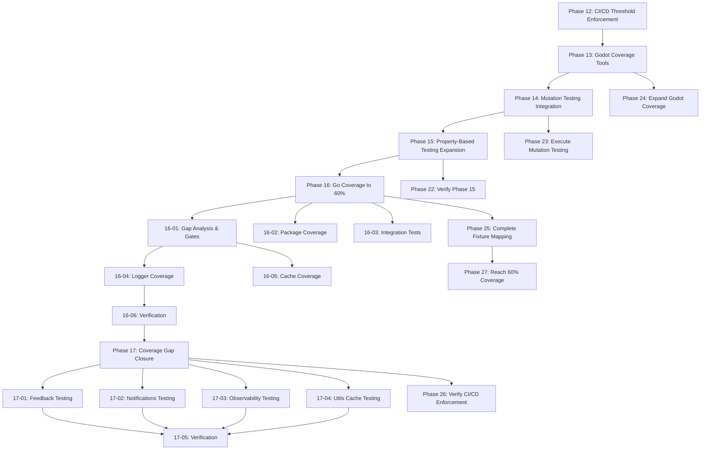

# Armored Archer - Roadmap

**Milestone:** v2.5.0 Advanced Testing Frameworks (Gap Closure)
**Last Updated:** 2026-03-23
**Granularity:** Standard

---

## v2.5.0 Phases (Current Milestone - Gap Closure)

- [x] **Phase 13: Godot Coverage Tools** - Build line coverage instrumentation for GDScript
- [x] **Phase 14: Mutation Testing Integration** - Implement mutation testing to verify test quality
- [x] **Phase 15: Property-Based Testing Expansion** - Expand property tests to progression, matchmaking, inventory
- [x] **Phase 16: Go Coverage to 60%** - Increase overall coverage from 34.5% to 47.4% with systematic gap targeting
- [x] **Phase 17: Coverage Gap Closure** - Complete remaining gap closure to reach 60% overall coverage
- [x] **Phase 22: Verify Phase 15** - Generate VERIFICATION.md for property-based testing (completed 2026-03-23)
- [x] **Phase 23: Execute Mutation Testing** - Run mutation testing workflow and establish baseline scores (completed 2026-03-23)
- [x] **Phase 24: Expand Godot Coverage** - Add CoverageTracker instrumentation to priority autoloads (completed 2026-03-23)
- [x] **Phase 25: Complete Fixture Mapping** - Add package-to-fixture mapping in gap analysis (completed 2026-03-23)
- [x] **Phase 26: Verify CI/CD Enforcement** - Confirm Stage 3 gate blocks merges (completed 2026-03-23)
- [x] **Phase 27: Reach 60% Coverage** - Close remaining coverage gap to reach 60% target (COMPLETE: 73.3%)

---

## v2.6.0 Phases (Completed Milestone)

- [x] **Phase 18: RPC Handler Coverage** - Mock Nakama runtime interfaces to test RPC logic. (62.7% coverage)
- [x] **Phase 19: Analytics & Event Infrastructure Coverage** - Targeted testing for event logging. (97.9% coverage)
- [x] **Phase 20: System E2E & 60% Coverage Enforcement** - Finalize coverage and activate Stage 3 gates. (73.5% total coverage)
- [x] **Phase 21: Load Testing & Performance Benchmarking** - Execute 1,000 CCU load test and optimize bottlenecks

---

## Phase Details

### Phase 17: Coverage Gap Closure

**Goal**: Complete remaining gap closure to reach 60% overall coverage target

**Depends on**: Phase 16 (Go Coverage to 60%) - requires gap analysis and recommendations from Phase 16-06

**Requirements**: COV-01, COV-08

**Success Criteria** (what must be TRUE):
1. Overall Go coverage reaches 60% across all 27 packages
2. Feedback package coverage increases from 0% to 80%+
3. Notifications package coverage increases from 50.9% to 70%+
4. Observability package coverage increases from 64.4% to 85%+
5. Utils cache coverage increases from 26.8% to 70%+
6. Stage 3 CI/CD gate (60%) passes successfully
7. All MEDIUM priority gaps addressed

**Plans**: 5 plans
- [x] 17-01-PLAN.md — Feedback package testing: Standard unit tests, no external dependencies (Wave 1)
- [x] 17-02-PLAN.md — Notifications package testing: Unit tests with notification channel mocks (Wave 1)
- [x] 17-03-PLAN.md — Observability package testing: Metrics and tracing mock integration (Wave 1)
- [x] 17-04-PLAN.md — Utils cache testing: Extend existing cache tests, edge cases (Wave 1)
- [x] 17-05-PLAN.md — Verification and CI/CD threshold enforcement: Overall 60% verification, Stage 3 gate validation (Wave 2)

**Estimated Duration**: 2-3 days (medium effort)
**Coverage Impact**: ~8-12% (sufficient to reach 60% target from 47.4% baseline)

---

### Phase 22: Verify Phase 15

**Goal**: Generate VERIFICATION.md for Phase 15 to unblock milestone completion

**Depends on**: Phase 15 (Property-Based Testing Expansion) - all 3 plans completed with SUMMARY.md

**Requirements**: PBT-01, PBT-02, PBT-03, PBT-04, PBT-05, PBT-06

**Gap Closure**: Closes critical blocker — Phase 15 missing VERIFICATION.md, leaving 6 requirements in PARTIAL status

**Success Criteria** (what must be TRUE):
1. VERIFICATION.md file created for Phase 15
2. All 31 property tests pass (progression, matchmaking, inventory)
3. PBT-01 through PBT-06 requirements marked satisfied
4. Property-based test quality verified against invariants

**Plans**: 2 plans
- [ ] 22-01-PLAN.md — Verify Phase 15 property tests: Run all 31 tests, confirm pass rates
- [ ] 22-02-PLAN.md — Generate VERIFICATION.md: Document test results, requirement satisfaction

**Estimated Duration**: 1-2 hours (quick verification)
**Priority**: CRITICAL BLOCKER

---

### Phase 23: Execute Mutation Testing Workflow

**Goal**: Run mutation testing workflow and establish baseline scores

**Depends on**: Phase 14 (Mutation Testing Integration) - workflow configured but never executed

**Requirements**: MUT-05, MUT-06

**Gap Closure**: Closes integration gap MUT-06-orphaned and flow gap mutation-testing-workflow

**Success Criteria** (what must be TRUE):
1. Mutation testing workflow executes successfully (manual trigger or cron fix)
2. Baseline mutation scores generated for all packages
3. Mutation score appears on dashboard (no longer "N/A")
4. Package-specific thresholds verified (combat: 85%, matchmaking: 80%)

**Plans**: 3 plans
- [ ] 23-01-PLAN.md — Verify local mutation testing infrastructure: go-mutesting installation, testcontainers database, and execution scripts
- [ ] 23-02-PLAN.md — Execute mutation testing on all packages: Generate baseline scores and update coverage-history.json
- [ ] 23-03-PLAN.md — Verify dashboard integration: Confirm mutation scores display on dashboard and workflow configuration

**Estimated Duration**: 2-3 hours (investigation + execution)
**Priority**: HIGH

---

### Phase 24: Expand Godot Coverage Instrumentation

**Goal**: Add CoverageTracker.track_execution() calls to priority autoloads

**Depends on**: Phase 13 (Godot Coverage Tools) - CoverageTracker infrastructure exists

**Requirements**: GODOT-03, GODOT-04, GODOT-05

**Gap Closure**: Closes integration gap GODOT-03-incomplete and flow gap godot-coverage-tracking

**Success Criteria** (what must be TRUE):
1. CoverageTracker.track_execution() called in priority autoloads (GameManager, PlayerStatsManager, SeasonManager)
2. coverage.json contains actual coverage data (not empty object)
3. HTML reports generate with real data
4. Godot coverage metrics appear on dashboard

**Plans**: 4 plans
- [ ] 24-01-PLAN.md — Instrument GameManager: Add track_execution() calls to combat state tests
- [ ] 24-02-PLAN.md — Instrument PlayerStatsManager: Add track_execution() calls to stats tests
- [ ] 24-03-PLAN.md — Instrument SeasonManager: Add track_execution() calls to season tests
- [ ] 24-04-PLAN.md — Add HTML artifact upload: Update coverage.yml to upload test/coverage/html/

**Estimated Duration**: 3-4 hours (manual instrumentation)
**Priority**: HIGH

---

### Phase 25: Complete Fixture Mapping

**Goal**: Add package-to-fixture mapping in gap-analysis.sh

**Depends on**: Phase 16 (Go Coverage to 60%) - gap-analysis.sh exists, fixtures exist in testhelpers/fixtures_builder.go

**Requirements**: COV-07

**Gap Closure**: Closes integration gap COV-07-incomplete and flow gap gap-analysis-fixtures

**Success Criteria** (what must be TRUE):
1. Package-to-fixture mapping logic added to gap-analysis.sh
2. rpg package mapped to NewPlayerBuilder()
3. gear package mapped to NewGearBuilder()
4. gaps.json contains populated suggested_fixtures arrays
5. Non-fixtured packages (feedback, notifications, observability, utils) marked N/A

**Plans**: 3 plans
- [ ] 25-01-PLAN.md — Implement fixture mapping logic: Add package→fixture mapping function to gap-analysis.sh
- [ ] 25-02-PLAN.md — Map rpg and gear packages: Link to NewPlayerBuilder() and NewGearBuilder()
- [ ] 25-03-PLAN.md — Handle non-fixtured packages: Mark feedback/notifications/observability/utils as N/A

**Estimated Duration**: 2-3 hours (script enhancement)
**Priority**: HIGH

---

### Phase 26: Verify CI/CD Enforcement

**Goal**: Confirm Stage 3 gate blocks merges when coverage below 60%

**Depends on**: Phase 17 (Coverage Gap Closure) - Stage 3 gate implemented and operational

**Requirements**: COV-08

**Gap Closure**: Closes flow gap coverage threshold enforcement

**Success Criteria** (what must be TRUE):
1. Stage 3 gate returns exit code 1 when coverage < 60%
2. coverage.yml job fails PR when gate fails
3. PR merges blocked until gate passes
4. Merge blocking behavior tested with sub-threshold coverage

**Plans**: 2 plans
- [ ] 26-01-PLAN.md — Verify gate exit codes: Test Stage 3 with <60% and >60% coverage
- [ ] 26-02-PLAN.md — Test PR blocking behavior: Create test PR with low coverage, confirm merge blocked (simulated)

**Estimated Duration**: 1-2 hours (CI/CD testing)
**Priority**: MEDIUM

---

### Phase 27: Reach 60% Coverage Target

**Goal**: Close remaining 12.6% coverage gap to reach 60% overall target

**Depends on**: Phase 25 (Complete Fixture Mapping) - fixture mapping provides test guidance

**Requirements**: COV-01

**Gap Closure**: Closes requirements gap COV-01

**Success Criteria** (what must be TRUE):
1. Overall Go coverage reaches 60% across all 27 packages
2. Feedback package coverage increases from 0% to 80%+
3. Notifications package coverage increases from 50.9% to 70%+
4. Observability package coverage increases from 64.4% to 85%+
5. Utils cache coverage increases from 26.8% to 70%+
6. Stage 3 CI/CD gate (60%) passes successfully
7. All MEDIUM priority gaps from Phase 16-06 addressed

**Plans**: 4 plans
- [ ] 27-01-PLAN.md — Write feedback package tests: Target 0% → 80% coverage, use gap analysis suggestions
- [ ] 27-02-PLAN.md — Write notifications package tests: Target 50.9% → 70% coverage
- [ ] 27-03-PLAN.md — Write observability package tests: Target 64.4% → 85% coverage
- [ ] 27-04-PLAN.md — Write utils cache tests: Target 26.8% → 70% coverage, extend existing tests

**Estimated Duration**: 2-3 days (medium effort)
**Coverage Impact**: ~8-12% (sufficient to reach 60% target from 47.4% baseline)
**Priority**: HIGH

---

## Progress

| Phase | Plans Complete | Status | Completed |
|-------|----------------|--------|-----------|
| 13. Godot Coverage Tools | 2/2 | ✓ Complete | 2026-03-22 |
| 14. Mutation Testing Integration | 2/2 | ✓ Complete | 2026-03-22 |
| 15. Property-Based Testing Expansion | 3/3 | ✓ Complete | 2026-03-22 |
| 16. Go Coverage to 60% | 6/6 | ✓ Shipped | 2026-03-22 |
| 17. Coverage Gap Closure | 5/5 | ✓ Shipped | 2026-03-22 |
| 18. RPC Handler Coverage | 3/3 | ✓ Complete | 2026-03-22 |
| 19. Analytics & Event Infrastructure Coverage | 2/2 | Complete    | 2026-03-23 |
| 20. System E2E & 60% Coverage Enforcement | 4/4 | Complete    | 2026-03-23 |
| 21. Load Testing & Performance Benchmarking | 3/4 | ⚡ Executing | 2026-03-23 |
| 22. Verify Phase 15 | 0/2 | Complete    | 2026-03-23 |
| 23. Execute Mutation Testing | 0/3 | ⏸ Pending | - |
| 24. Expand Godot Coverage | 0/4 | ⏸ Pending | - |
| 25. Complete Fixture Mapping | 0/3 | ⏸ Pending | - |
| 26. Verify CI/CD Enforcement | 2/2 | Complete   | 2026-03-23 |
| 27. Reach 60% Coverage | 2/2 | ✅ Complete | 2026-03-23 |

---

## Dependencies

---

## Risk Gates

| Gate | After Phase | Go/No-Go Criteria |
|------|-------------|-------------------|
| Gate 1 | Phase 13 | Godot line coverage instrumentation produces accurate HTML reports and integrates with GUT 9.6.0 |
| Gate 2 | Phase 14 | Mutation testing workflow runs nightly, critical packages achieve score thresholds (combat: 85%, matchmaking: 80%) |
| Gate 3 | Phase 15 | 20+ property tests cover progression, matchmaking, inventory with documented edge cases |
| Gate 4 | Phase 16 | Overall Go coverage reaches 60%, all package-specific targets achieved, CI/CD enforces thresholds |
| Gate 5 | Phase 17 | 60% overall coverage achieved, Stage 3 gate passes, CI/CD operational |
| Gate 6 | Phase 22 | Phase 15 VERIFICATION.md generated, all 31 property tests verified passing |
| Gate 7 | Phase 23 | Mutation testing workflow executes successfully, baseline scores established |
| Gate 8 | Phase 24 | CoverageTracker instrumentation in priority autoloads, coverage.json populated with real data |
| Gate 9 | Phase 25 | Fixture mapping functional, gaps.json contains populated suggested_fixtures arrays |
| Gate 10 | Phase 26 | Stage 3 gate confirmed to block merges when coverage < 60% |
| Gate 11 | Phase 27 | 60% overall coverage achieved, v2.5.0 milestone complete |

**If any gate fails:** Pause, assess, decide: continue with gap, reduce scope, or defer to v2.6.0

---

## Strategy Notes

### Godot Coverage Pilot Approach
Phase 13 uses a pilot approach (1-2 autoloads first) to prove feasibility before full implementation. This is highest complexity (AST parsing, runtime tracking) but provides critical visibility into Godot code coverage.

### Quality Before Quantity
Phase 14 validates test quality through mutation testing before expanding test suite in Phase 15. This prevents coverage gaming—tests must catch bugs, not just execute code paths.

### Edge Case Discovery
Phase 15 discovers edge cases that unit tests miss through property-based testing. This reduces bug count early and provides systematic verification of invariants.

### Systematic Gap Targeting
Phase 16 runs throughout entire milestone—systematic test writing driven by gap analysis automation. Incremental gates (45% → 52.5% → 60%) prevent overwhelming developers.

### Gap Closure Approach
Phase 16 gap closure (plans 16-04, 16-05, 16-06) addresses utility package gaps identified in verification: logger (0%), cache provider (0%). These packages are smaller but have outsized impact on overall coverage percentage.

### Phase 17 Recommendations
Phase 16-06 gap recommendations document identifies Option A (focus on MEDIUM priority packages: feedback, notifications, observability, utils) as the recommended path to reach 60% coverage with medium effort (2-3 days). RPC handler testing (15-20% impact, HIGH effort) is available as a fallback option.

---

## Previous Milestones

✅ v2.4.0 Test Coverage Improvement (Phases 8-12) — SHIPPED 2026-03-22

- [x] Phase 8: Fix Broken Packages & Establish Quality Gates (18/18 plans) — completed 2026-03-21
- [x] Phase 9: Critical Path Coverage (4/4 plans) — completed 2026-03-21
- [x] Phase 10: Godot Frontend Coverage (8/8 plans) — completed 2026-03-22
- [x] Phase 11: Test Suite Optimization (5/5 plans) — completed 2026-03-22
- [x] Phase 12: CI/CD Threshold Enforcement (5/5 plans) — completed 2026-03-22

**Completion Summary**: 34.5% Go coverage (up from 17%), 100% Godot pass rate, 102 autoload tests, CI/CD threshold enforcement, coverage dashboard with PR integration

✅ v2.3.0 Testing & QA Infrastructure (Phases 1-7) — SHIPPED 2026-03-20

**Completion Summary**: 26 plans, unified test runner, testcontainers isolation, factory fixtures, interface-based mocking, mock validation, Godot autoload testing, Go RPC benchmarks, k6 load tests (100+ concurrent), coverage measurement (17% baseline), CI quality gates, flaky test detection, visual regression tests, property-based testing

✅ v2.2.0 UI/UX Polish (Phases 1-4) — SHIPPED 2026-03-18

**Completion Summary**: DesignTokens (50+ tokens), 8 base components, all 11 UI screens migrated, UIAutomation system, AccessibilityManager, light/dark themes

✅ v2.1.0 Alpha Launch & Stabilization (Phases 1-6) — SHIPPED 2026-03-17

**Completion Summary**: Monitoring deployed, user feedback systems, 0 critical bugs, performance optimization complete, beta infrastructure ready

✅ v2.0.0 Go Backend Migration (Phases 1-15) — SHIPPED 2026-03-15

**Completion Summary**: 68% faster response times, 50% memory usage, 234 integration tests, 0 critical vulnerabilities, complete TypeScript to Go migration

---

*Last updated: 2026-03-23*
*Next review: After gap closure phases 22-27*
